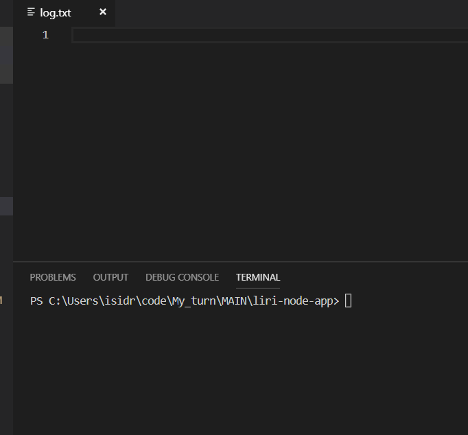

# LIRI
### LIRI is a Language Interpretation and Recognition Interface. It´s a command line node app that takes in parameters and gives you back data

1. LIRI searches Spotify for songs, Bands in Town for concerts, and OMDB for movies
   
2. To retrieve the data  this app needs to send requests using the `axios` package to the Bands in Town, Spotify and OMDB APIs.
   

## Installs

The package.json lists dependent node packages. You must to run "npm init" in your terminal. This will instal third party npm packages and saving their version number.

## Environment

1. To use `axios` package to the Bands in Town and OMDB APIs the project includes the appropriate credentials.
   
2. To get access to the Spotify API you must to sign up as a developer to generate the neccesary credentials visiting <https://developer.spotify.com/my-applications/#!/>. Generate a **client id** and **client secret**. 
   Navigate to <https://developer.spotify.com/my-applications/#!/applications/create> to register a new application to be used with the Spotify API.
   Create a `.env` file containing this instruccions (replace id and secret):

SPOTIFY_ID=your-spotify-id          ---> _client id_

SPOTIFY_SECRET=your-spotify-secret  ---> _client secret_

## Get Started

1. Main Menu, select 1 listed option:
   - "concert-this" for search a venue,
   - "spotify-this-song" for get information about a particular song,
   - "movie-this" to look movies information and
   - "do-what-it-says" looks for a default option.

   
2. You must to enter a string describing and acording with your choice,
   then the information will be displayed in your terminal.

      
3. A log with all the results will be write-append in a log.txt file

## Technologies used to build app

   - [Node.js,](https://nodejs.org/en/)
   - [Javascript,](https://www.w3schools.com/js/default.asp)
   - [ScreenToGif - Editor,](https://www.screentogif.com/)
   - API's : Bands In Town, OMDB, Spotify
   - Node Packages :
     - moment
     - dotenv
     - inquirer,
     - node-spotify-api
     - axios.

## Future code development

The code can definetly could be more clean!!!.

## Author

[Isidro Quevedo](https://iquevedom.github.io/My_Bio/)

## License

This project can be cloned it under the author license.
